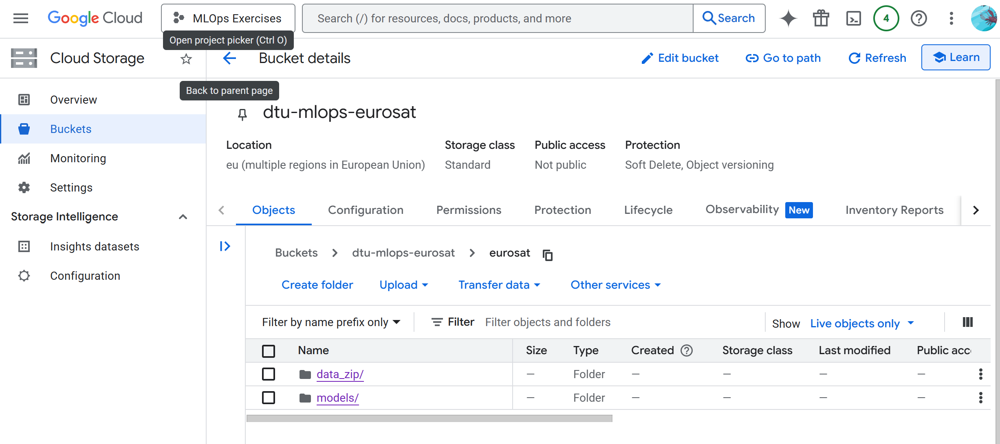
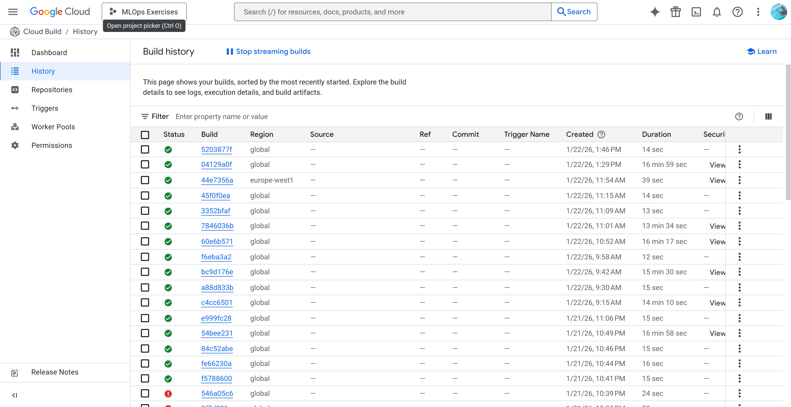

# Exam template for 02476 Machine Learning Operations

This is the report template for the exam. Please only remove the text formatted as with three dashes in front and behind
like:

```--- question 1 fill here ---```

Where you instead should add your answers. Any other changes may have unwanted consequences when your report is
auto-generated at the end of the course. For questions where you are asked to include images, start by adding the image
to the `figures` subfolder (please only use `.png`, `.jpg` or `.jpeg`) and then add the following code in your answer:

``

In addition to this markdown file, we also provide the `report.py` script that provides two utility functions:

Running:

```bash
python report.py html
```

Will generate a `.html` page of your report. After the deadline for answering this template, we will auto-scrape
everything in this `reports` folder and then use this utility to generate a `.html` page that will be your serve
as your final hand-in.

Running

```bash
python report.py check
```

Will check your answers in this template against the constraints listed for each question e.g. is your answer too
short, too long, or have you included an image when asked. For both functions to work you mustn't rename anything.
The script has two dependencies that can be installed with

```bash
pip install typer markdown
```

or

```bash
uv add typer markdown
```

## Overall project checklist

The checklist is *exhaustive* which means that it includes everything that you could do on the project included in the
curriculum in this course. Therefore, we do not expect at all that you have checked all boxes at the end of the project.
The parenthesis at the end indicates what module the bullet point is related to. Please be honest in your answers, we
will check the repositories and the code to verify your answers.

### Week 1

* [x] Create a git repository (M5)
* [x] Make sure that all team members have write access to the GitHub repository (M5)
* [x] Create a dedicated environment for you project to keep track of your packages (M2)
* [x] Create the initial file structure using cookiecutter with an appropriate template (M6)
* [x] Fill out the `data.py` file such that it downloads whatever data you need and preprocesses it (if necessary) (M6)
* [x] Add a model to `model.py` and a training procedure to `train.py` and get that running (M6)
* [x] Remember to fill out the `requirements.txt` and `requirements_dev.txt` file with whatever dependencies that you
    are using (M2+M6)
* [x] Remember to comply with good coding practices (`pep8`) while doing the project (M7)
* [x] Do a bit of code typing and remember to document essential parts of your code (M7)
* [x] Setup version control for your data or part of your data (M8)
* [ ] Add command line interfaces and project commands to your code where it makes sense (M9)
* [ ] Construct one or multiple docker files for your code (M10)
* [x] Build the docker files locally and make sure they work as intended (M10)
* [x] Write one or multiple configurations files for your experiments (M11)
* [x] Used Hydra to load the configurations and manage your hyperparameters (M11)
* [x] Use profiling to optimize your code (M12)
* [x] Use logging to log important events in your code (M14)
* [x] Use Weights & Biases to log training progress and other important metrics/artifacts in your code (M14)
* [x] Consider running a hyperparameter optimization sweep (M14)
* [x] Use PyTorch-lightning (if applicable) to reduce the amount of boilerplate in your code (M15)

### Week 2

* [x] Write unit tests related to the data part of your code (M16)
* [x] Write unit tests related to model construction and or model training (M16)
* [x] Calculate the code coverage (M16)
* [x] Get some continuous integration running on the GitHub repository (M17)
* [x] Add caching and multi-os/python/pytorch testing to your continuous integration (M17)
* [x] Add a linting step to your continuous integration (M17)
* [x] Add pre-commit hooks to your version control setup (M18)
* [ ] Add a continues workflow that triggers when data changes (M19)
* [ ] Add a continues workflow that triggers when changes to the model registry is made (M19)
* [x] Create a data storage in GCP Bucket for your data and link this with your data version control setup (M21)
* [x] Create a trigger workflow for automatically building your docker images (M21)
* [x] Get your model training in GCP using either the Engine or Vertex AI (M21)
* [x] Create a FastAPI application that can do inference using your model (M22)
* [ ] Deploy your model in GCP using either Functions or Run as the backend (M23)
* [ ] Write API tests for your application and setup continues integration for these (M24)
* [ ] Load test your application (M24)
* [ ] Create a more specialized ML-deployment API using either ONNX or BentoML, or both (M25)
* [ ] Create a frontend for your API (M26)

### Week 3

* [ ] Check how robust your model is towards data drifting (M27)
* [ ] Deploy to the cloud a drift detection API (M27)
* [ ] Instrument your API with a couple of system metrics (M28)
* [ ] Setup cloud monitoring of your instrumented application (M28)
* [ ] Create one or more alert systems in GCP to alert you if your app is not behaving correctly (M28)
* [ ] If applicable, optimize the performance of your data loading using distributed data loading (M29)
* [ ] If applicable, optimize the performance of your training pipeline by using distributed training (M30)
* [ ] Play around with quantization, compilation and pruning for you trained models to increase inference speed (M31)

### Extra

* [ ] Write some documentation for your application (M32)
* [ ] Publish the documentation to GitHub Pages (M32)
* [ ] Revisit your initial project description. Did the project turn out as you wanted?
* [ ] Create an architectural diagram over your MLOps pipeline
* [x] Make sure all group members have an understanding about all parts of the project
* [x] Uploaded all your code to GitHub

## Group information

### Question 1
> **Enter the group number you signed up on <learn.inside.dtu.dk>**
>
> Answer:

10

### Question 2
> **Enter the study number for each member in the group**
>
> Example:
>
> *sXXXXXX, sXXXXXX, sXXXXXX*
>
> Answer:

s253114, s252840

### Question 3
> **A requirement to the project is that you include a third-party package not covered in the course. What framework**
> **did you choose to work with and did it help you complete the project?**
>
> Recommended answer length: 100-200 words.
>
> Example:
> *We used the third-party framework ... in our project. We used functionality ... and functionality ... from the*
> *package to do ... and ... in our project*.
>
> Answer:

We chose to use timm (PyTorch Image Models), which was not covered in the course.
It provides a large collection of state-of-the-art computer vision models with consistent APIs and well-maintained pretrained weights, which significantly helped us complete the project more efficiently and robustly.
Instead of implementing and maintaining convolutional architectures from scratch, we could directly leverage proven models such as ResNet, ensuring strong baseline performance on the EuroSAT dataset. This allowed us to focus more on data handling, training pipelines, evaluation, and MLOps aspects rather than low-level model definitions.
Additionally, timm integrates seamlessly with PyTorch and supports easy switching between architectures, which was useful for experimentation and comparison.
The availability of pretrained weights also improved convergence speed and final accuracy, especially given the limited size of the dataset.

## Coding environment

> In the following section we are interested in learning more about you local development environment. This includes
> how you managed dependencies, the structure of your code and how you managed code quality.

### Question 4

> **Explain how you managed dependencies in your project? Explain the process a new team member would have to go**
> **through to get an exact copy of your environment.**
>
> Recommended answer length: 100-200 words
>
> Example:
> *We used ... for managing our dependencies. The list of dependencies was auto-generated using ... . To get a*
> *complete copy of our development environment, one would have to run the following commands*
>
> Answer:

We managed dependencies using uv, a modern Python package and environment manager that provides fast, reproducible dependency resolution.
All project dependencies are declared in a single pyproject.toml file, separated into runtime dependencies and development dependencies.
From this configuration, uv generates a locked dependency file (uv.lock) that pins exact package versions and transitive dependencies,
ensuring full reproducibility across machines and platforms.
The development workflow is fully deterministic, so a new team member can obtain an exact copy of the environment by following a small number of steps.
First, they clone the repository. Then, after installing uv, they simply run:

'''bash
uv sync --dev --locked
'''

This command creates a virtual environment and installs exactly the versions specified in the lockfile, guaranteeing that everyone works with the same dependency set.
No manual version management is required.
Additionally, we use uv run to execute tools such as pytest, ruff, mypy, and coverage inside the managed environment,
avoiding reliance on global Python installations.

### Question 5

> **We expect that you initialized your project using the cookiecutter template. Explain the overall structure of your**
> **code. What did you fill out? Did you deviate from the template in some way?**
>
> Recommended answer length: 100-200 words
>
> Example:
> *From the cookiecutter template we have filled out the ... , ... and ... folder. We have removed the ... folder*
> *because we did not use any ... in our project. We have added an ... folder that contains ... for running our*
> *experiments.*
>
> Answer:

We initialized the project using the provided cookiecutter template, which already contained the full Python package
structure under the src/ directory, including files such as train, evaluate, and prediction scripts. We did not alter
this core structure, but instead filled in the existing Python modules with our own implementation, replacing the placeholder
logic with fully functional code for data loading, training, evaluation, and inference.

In addition to the template, we extended the project structure where required by the assignment and by MLOps best practices.
We created the .github/workflows directory to define GitHub Actions pipelines for linting, type checking, testing, and
coverage reporting, as this was not included in the original template. We also added a data/ directory to manage datasets,
a docs/ folder for documentation, and a cloud_deploy/ folder to support deployment-related artifacts.

Some directories were generated automatically by tools we adopted, such as lightning_logs for PyTorch Lightning training
logs, outputs/ for Hydra experiment outputs, and reports/ for project deliverables and evaluation artifacts.

### Question 6

> **Did you implement any rules for code quality and format? What about typing and documentation? Additionally,**
> **explain with your own words why these concepts matters in larger projects.**
>
> Recommended answer length: 100-200 words.
>
> Example:
> *We used ... for linting and ... for formatting. We also used ... for typing and ... for documentation. These*
> *concepts are important in larger projects because ... . For example, typing ...*
>
> Answer:

We enforced several rules for code quality, formatting, typing, and documentation throughout the project.
For code style and linting, we used Ruff, which allowed us to apply consistent formatting and detect common programming  
errors early. Ruff was run both locally and in the CI pipeline to ensure the same standards were enforced across the team.
Formatting was handled automatically to avoid style discussions and reduce noise in code reviews.
For typing, we used Mypy to perform static type checking. While not all third-party libraries provide full type hints,
Mypy still helped us catch mismatched function signatures, invalid assumptions about data structures, and unintended None
usage early in development. Type checking was included in CI to prevent regressions.
Documentation was handled through docstrings and a dedicated docs/ folder, ensuring that training, evaluation, and data
handling logic is understandable for new contributors.
These concepts are crucial in larger projects because they scale human collaboration. Consistent formatting improves
readability, typing reduces runtime errors and misunderstandings, and documentation lowers the onboarding cost for new
team members while improving long-term maintainability.

## Version control

> In the following section we are interested in how version control was used in your project during development to
> corporate and increase the quality of your code.

### Question 7

> **How many tests did you implement and what are they testing in your code?**
>
> Recommended answer length: 50-100 words.
>
> Example:
> *In total we have implemented X tests. Primarily we are testing ... and ... as these the most critical parts of our*
> *application but also ... .*
>
> Answer:

In total we implemented 3 tests. The first test validates the training workflow by mocking the model, dataloaders and
validation step, and checks that the best checkpoint is saved (i.e., eurosat_best.pth is written when validation improves).
The second test covers the model forward pass, ensuring EuroSATModel can be instantiated and produces logits with the
expected shape for typical EuroSAT inputs. The third test verifies the data pipeline, checking that get_dataloaders returns
non-empty DataLoaders and yields correctly shaped RGB batches, skipping gracefully if the dataset is not available.

### Question 8

> **What is the total code coverage (in percentage) of your code? If your code had a code coverage of 100% (or close**
> **to), would you still trust it to be error free? Explain you reasoning.**
>
> Recommended answer length: 100-200 words.
>
> Example:
> *The total code coverage of code is X%, which includes all our source code. We are far from 100% coverage of our **
> *code and even if we were then...*
>
> Answer:

Our total code coverage is 40% (214 missed statements out of 357), measured with coverage.py over the src/ package.
Coverage is uneven: core utilities like data.py are fully covered (100%), while important entry-point scripts such as
evaluate.py and predict_folder.py currently have 0% coverage, mainly because we did not add dedicated tests for their
CLI-style logic and file-system interactions.
Even with 100% coverage, we would not automatically trust the code to be error-free. Coverage only tells us that lines
were executed, not that they were asserted meaningfully, tested under realistic conditions, or exercised across edge cases
(e.g., corrupted images, missing classes, different devices, race conditions, performance regressions).
High coverage can still miss bugs if tests are shallow, overly mocked, or don’t validate correct behavior. We treat
coverage as a feedback metric to find untested areas, not as proof of correctness.

| File                       | Statements | Missed  | Coverage | Missing Lines                      |
|----------------------------|------------|---------|----------|------------------------------------|
| `data.py`                  | 24         | 0       | 100%     | –                                  |
| `evaluate.py`              | 49         | 49      | 0%       | 1–104                              |
| `model.py`                 | 27         | 6       | 78%      | 81–95, 99                          |
| `predict_folder.py`        | 53         | 53      | 0%       | 1–169                              |
| `scripts/download_data.py` | 51         | 40      | 22%      | 13–15, 23–33, 53–103, 107          |
| `test.py`                  | 30         | 30      | 0%       | 3–89                               |
| `train.py`                 | 123        | 36      | 71%      | 28–44, 65–67, 86–108, 258–279, 296 |
| **TOTAL**                  | **357**    | **214** | **40%**  |                                    |

### Question 9

> **Did you workflow include using branches and pull requests? If yes, explain how. If not, explain how branches and**
> **pull request can help improve version control.**
>
> Recommended answer length: 100-200 words.
>
> Example:
> *We made use of both branches and PRs in our project. In our group, each member had an branch that they worked on in*
> *addition to the main branch. To merge code we ...*
>
> Answer:

Yes, our workflow relied on feature branches + pull requests. Each change was developed on a dedicated branch (e.g., feat/eurosat)
instead of committing directly to main. When a feature was ready, we opened a PR targeting main, which acted as the main
integration point and protected branch for stable code.
PRs triggered our CI checks to catch issues early and consistently. In particular, we ran Codecheck on PRs to main
(pre-commit hygiene, Ruff formatting/linting, and “soft” mypy), and a separate Tests workflow to run the unit test matrix
across OSes and Python versions. This gave fast feedback before merging and helped prevent formatting regressions, obvious
lint violations, and breaking tests from entering main.
Branches and PRs improved version control by keeping main clean and deployable, making changes reviewable, and allowing
us to iterate safely without destabilizing the shared codebase.

### Question 10

> **Did you use DVC for managing data in your project? If yes, then how did it improve your project to have version**
> **control of your data. If no, explain a case where it would be beneficial to have version control of your data.**
>
> Recommended answer length: 100-200 words.
>
> Example:
> *We did make use of DVC in the following way: ... . In the end it helped us in ... for controlling ... part of our*
> *pipeline*
>
> Answer:

Yes, we used DVC to manage datasets in our project.
Instead of committing large data files directly to Git, we tracked them with DVC, while storing the actual data in a remote Google Cloud Bucket : this allowed us to version datasets in a Git-like way without bloating the repository.
DVC improved our project in several ways. First, it ensured reproducibility: every experiment and training run could be
associated with a specific data version, making results traceable and comparable over time. Second, it enabled team
collaboration, as all team members could pull the exact same dataset version using dvc pull, avoiding inconsistencies
caused by local data copies. Third, it integrated cleanly with our CI/CD pipeline, where data could be fetched automatically
before training or evaluation, ensuring that pipelines always ran on the correct inputs.

### Question 11

> **Discuss you continuous integration setup. What kind of continuous integration are you running (unittesting,**
> **linting, etc.)? Do you test multiple operating systems, Python  version etc. Do you make use of caching? Feel free**
> **to insert a link to one of your GitHub actions workflow.**
>
> Recommended answer length: 200-300 words.
>
> Example:
> *We have organized our continuous integration into 3 separate files: one for doing ..., one for running ... testing*
> *and one for running ... . In particular for our ..., we used ... .An example of a triggered workflow can be seen*
> *here: <weblink>*
>
> Answer:

We have designed our continuous integration pipeline to be modular, explicit, and aligned with MLOps best practices.
It is organized into three separate GitHub Actions workflows, each with a clear responsibility: code quality checks, unit
testing, and deployment/training automation.
First, we use a Codecheck workflow that runs on every pull request targeting the main branch. This workflow acts as a
quality gate and focuses on code hygiene and static analysis. It runs pre-commit hooks (e.g. whitespace checks, YAML/TOML
validation, secret detection), Ruff for formatting and linting, and Mypy for static type checking.
While pre-commit is also executed locally by developers, enforcing it in CI guarantees consistency across contributors
and environments.
Second, we maintain a dedicated Tests workflow for unit testing. Every test is executed with pytest and are run in a
matrix setup across multiple operating systems (Ubuntu, Windows, macOS) and multiple Python versions (3.11 and 3.12).
This ensures that our codebase is portable and behaves consistently across platforms, which is especially important for
machine learning pipelines that may rely on OS-specific dependencies.
Third, we have a Train and Deploy workflow triggered on pushes to main. This workflow integrates MLOps-specific steps
such as pulling data with DVC, building Docker images via Google Cloud Build, submitting training jobs to Vertex AI,
and deploying a FastAPI inference service.
Across all workflows, we make extensive use of dependency caching via uv, significantly reducing CI execution time by
reusing previously resolved dependencies. An example workflow configuration can be found in our repository under
.github/workflows/codecheck.yaml.

## Running code and tracking experiments

> In the following section we are interested in learning more about the experimental setup for running your code and
> especially the reproducibility of your experiments.

### Question 12

> **How did you configure experiments? Did you make use of config files? Explain with coding examples of how you would**
> **run a experiment.**
>
> Recommended answer length: 50-100 words.
>
> Example:
> *We used a simple argparser, that worked in the following way: Python  my_script.py --lr 1e-3 --batch_size 25*
>
> Answer:

--- question 12 fill here ---

### Question 13

> **Reproducibility of experiments are important. Related to the last question, how did you secure that no information**
> **is lost when running experiments and that your experiments are reproducible?**
>
> Recommended answer length: 100-200 words.
>
> Example:
> *We made use of config files. Whenever an experiment is run the following happens: ... . To reproduce an experiment*
> *one would have to do ...*
>
> Answer:

--- question 13 fill here ---

### Question 14

> **Upload 1 to 3 screenshots that show the experiments that you have done in W&B (or another experiment tracking**
> **service of your choice). This may include loss graphs, logged images, hyperparameter sweeps etc. You can take**
> **inspiration from [this figure](figures/wandb.png). Explain what metrics you are tracking and why they are**
> **important.**
>
> Recommended answer length: 200-300 words + 1 to 3 screenshots.
>
> Example:
> *As seen in the first image when have tracked ... and ... which both inform us about ... in our experiments.*
> *As seen in the second image we are also tracking ... and ...*
>
> Answer:

As shown in the screenshot below, we used Weights & Biases (W&B) to track both batch-level training metrics and epoch-level
validation metrics for our EuroSAT experiments.

During training, we logged **train loss** and **train accuracy** **per batch**. Logging these at a high frequency is
useful for monitoring optimization dynamics in near real time: the training loss should generally decrease as the model
learns, while training accuracy should increase. Batch-level curves also make it easy to spot instability early (e.g.,
diverging loss, spikes due to an overly high learning rate, or noisy gradients from an aggressive batch size).

After each epoch, we evaluated on a held-out validation split and logged **validation loss** and **validation accuracy**.
These metrics are important because they provide a more reliable proxy for generalization than training metrics. In
particular, comparing training vs. validation curves helps diagnose **overfitting**: if training loss keeps decreasing
while validation loss plateaus or increases, the model is likely memorizing the training set. Conversely, if both training
and validation metrics improve steadily, it indicates that the learned representations generalize.

We primarily used validation accuracy as a model-selection signal (choose the best checkpoint), while validation loss was
used as a more sensitive indicator of generalization and calibration changes that may not immediately show up in accuracy.
Overall, W&B made experiments easier to compare across runs and helped us pick hyperparameters that improved validation
performance rather than only optimizing for training behavior.


### Question 15

> **Docker is an important tool for creating containerized applications. Explain how you used docker in your**
> **experiments/project? Include how you would run your docker images and include a link to one of your docker files.**
>
> Recommended answer length: 100-200 words.
>
> Example:
> *For our project we developed several images: one for training, inference and deployment. For example to run the*
> *training docker image: `docker run trainer:latest lr=1e-3 batch_size=64`. Link to docker file: <weblink>*
>
> Answer:

We used Docker to ensure a reproducible runtime for both local runs and cloud training. In particular, we built a GPU-enabled
training image that bundles our source code, pinned Python dependencies, and the CUDA-compatible PyTorch stack. This removed
“works on my machine” issues and made it straightforward to run the same training entrypoint locally, in CI, and on GCP.

For cloud training we used the image as a **custom container** for Vertex AI. The container is built in Google Cloud Build
and pushed to Artifact Registry, after which a Vertex AI CustomJob launches the container on a GPU machine and executes our
training script with the desired Hydra/config overrides. Locally, the same image can be built and run with:

`docker build -f train_gpu.dockerfile -t eurosat-train:latest .`

`docker run --gpus all --rm eurosat-train:latest python -m src.train`

Link to Dockerfile: [train_gpu.dockerfile](../train_gpu.dockerfile)

### Question 16

> **When running into bugs while trying to run your experiments, how did you perform debugging? Additionally, did you**
> **try to profile your code or do you think it is already perfect?**
>
> Recommended answer length: 100-200 words.
>
> Example:
> *Debugging method was dependent on group member. Some just used ... and others used ... . We did a single profiling*
> *run of our main code at some point that showed ...*
>
> Answer:

--- question 16 fill here ---

## Working in the cloud

> In the following section we would like to know more about your experience when developing in the cloud.

### Question 17

> **List all the GCP services that you made use of in your project and shortly explain what each service does?**
>
> Recommended answer length: 50-200 words.
>
> Example:
> *We used the following two services: Engine and Bucket. Engine is used for... and Bucket is used for...*
>
> Answer:

We used the following GCP services in our project:

- **IAM & Service Accounts**: Managed authentication and authorization for both developers and GCP workloads. Service
  accounts were used to grant least-privilege access (e.g., reading from buckets and pulling container images).
- **Cloud Storage (Buckets)**: Stored our dataset and other large artifacts outside Git, enabling consistent access to the
  same data across machines and CI/cloud runs.
- **Artifact Registry**: Hosted our Docker images (including the GPU training image), making them easy to version and
  reuse across services.
- **Vertex AI**: Ran training as Custom Jobs using our custom Docker container on GPU machines.
- **Cloud Run**: Deployed our containerized inference API as a managed service with autoscaling and HTTPS endpoints.

We also explored **Compute Engine**, but did not use it in the final setup (we relied on Vertex AI + custom containers
instead).

### Question 18

> **The backbone of GCP is the Compute engine. Explained how you made use of this service and what type of VMs**
> **you used?**
>
> Recommended answer length: 100-200 words.
>
> Example:
> *We used the compute engine to run our ... . We used instances with the following hardware: ... and we started the*
> *using a custom container: ...*
>
> Answer:

We explored **Compute Engine** early in the project to understand the VM workflow and to validate that our training setup
could run on GCP-managed hardware. We tested two approaches: a “plain VM” workflow where we SSH’ed into the instance,
**cloned the repository**, created the environment, and ran smoke tests to ensure the training entrypoint could start,
access the dataset, and write outputs; and a containerized workflow where we pulled/built and ran our **Docker-based**
training setup to verify dependency and runtime consistency.

We briefly used low-cost **standard CPU VMs** for quick validation and then experimented with a **GPU VM** using an
**NVIDIA T4** to confirm CUDA/PyTorch compatibility and that our code ran end-to-end on GPU hardware.

Compute Engine was ultimately **not used in the final pipeline**. Once we moved to **Vertex AI Custom Jobs** with our
custom GPU training container, it provided a more purpose-built managed training interface and cleaner integration with
Cloud Build and Artifact Registry, so Compute Engine remained an exploration step rather than a core component.

### Question 19

> **Insert 1-2 images of your GCP bucket, such that we can see what data you have stored in it.**
> **You can take inspiration from [this figure](figures/bucket.png).**
>
> Answer:



### Question 20

> **Upload 1-2 images of your GCP artifact registry, such that we can see the different docker images that you have**
> **stored. You can take inspiration from [this figure](figures/registry.png).**
>
> Answer:


### Question 21

> **Upload 1-2 images of your GCP cloud build history, so we can see the history of the images that have been build in**
> **your project. You can take inspiration from [this figure](figures/build.png).**
>
> Answer:



### Question 22

> **Did you manage to train your model in the cloud using either the Engine or Vertex AI? If yes, explain how you did**
> **it. If not, describe why.**
>
> Recommended answer length: 100-200 words.
>
> Example:
> *We managed to train our model in the cloud using the Engine. We did this by ... . The reason we choose the Engine*
> *was because ...*
>
> Answer:

We trained our model in the cloud using **Vertex AI Custom Jobs** (rather than Compute Engine). Training was triggered via a
Cloud Build workflow defined in [`cloud_deploy/vertex_ai_train.yaml`](../cloud_deploy/vertex_ai_train.yaml), which submits a
Vertex job using `gcloud ai custom-jobs create` with a GPU job spec from `cloud_deploy/config_gpu.yaml`.

The workflow uses a dedicated **service account** to follow least-privilege access and to allow the
job to pull the training container image from **Artifact Registry** and read/write required artifacts (e.g., data/checkpoints).
For experiment tracking, the **W&B API key** is stored in **Secret Manager** and injected at build/job time via
`availableSecrets` as the `WANDB_API_KEY` environment variable, so credentials are never committed to the repository.

Using Vertex AI + custom containers made training reproducible and operationally simpler than managing our own VMs, while
still letting us run the exact same Docker image locally and in the cloud.

## Deployment

### Question 23

> **Did you manage to write an API for your model? If yes, explain how you did it and if you did anything special. If**
> **not, explain how you would do it.**
>
> Recommended answer length: 100-200 words.
>
> Example:
> *We did manage to write an API for our model. We used FastAPI to do this. We did this by ... . We also added ...*
> *to the API to make it more ...*
>
> Answer:

--- question 23 fill here ---

### Question 24

> **Did you manage to deploy your API, either in locally or cloud? If not, describe why. If yes, describe how and**
> **preferably how you invoke your deployed service?**
>
> Recommended answer length: 100-200 words.
>
> Example:
> *For deployment we wrapped our model into application using ... . We first tried locally serving the model, which*
> *worked. Afterwards we deployed it in the cloud, using ... . To invoke the service an user would call*
> *`curl -X POST -F "file=@file.json"<weburl>`*
>
> Answer:

--- question 24 fill here ---

### Question 25

> **Did you perform any unit testing and load testing of your API? If yes, explain how you did it and what results for**
> **the load testing did you get. If not, explain how you would do it.**
>
> Recommended answer length: 100-200 words.
>
> Example:
> *For unit testing we used ... and for load testing we used ... . The results of the load testing showed that ...*
> *before the service crashed.*
>
> Answer:

Yes, we performed unit testing of the core components using pytest. Our tests cover both “pure” model behavior and
pipeline integration points. For example, we test that EuroSATModel can be instantiated and produces logits of the expected
shape on a dummy input batch (sanity check for forward pass). We also test the data pipeline by validating that get_dataloaders()
returns valid DataLoader objects and yields correctly shaped tensors. Where the real EuroSAT dataset may not be present in CI,
the test is designed to skip safely rather than fail. In addition, we added a training-related unit test that uses monkeypatching
to replace heavy components (real dataloaders, optimizer, validation) and verifies that the training loop correctly saves
the “best” checkpoint (eurosat_best.pth).

---api test---
### Question 26

> **Did you manage to implement monitoring of your deployed model? If yes, explain how it works. If not, explain how**
> **monitoring would help the longevity of your application.**
>
> Recommended answer length: 100-200 words.
>
> Example:
> *We did not manage to implement monitoring. We would like to have monitoring implemented such that over time we could*
> *measure ... and ... that would inform us about this ... behaviour of our application.*
>
> Answer:

--- question 26 fill here ---

## Overall discussion of project

> In the following section we would like you to think about the general structure of your project.

### Question 27

> **How many credits did you end up using during the project and what service was most expensive? In general what do**
> **you think about working in the cloud?**
>
> Recommended answer length: 100-200 words.
>
> Example:
> *Group member 1 used ..., Group member 2 used ..., in total ... credits was spend during development. The service*
> *costing the most was ... due to ... . Working in the cloud was ...*
>
> Answer:

During the project we relied almost entirely on the free Google Cloud credits provided for the course.
According to the final cost breakdown, the total gross cloud usage amounted to approximately $1.78, which was fully
offset by savings and credits, resulting in $0.00 of actual charges.
The service with the highest nominal cost was Cloud Storage (about $1.17), mainly due to storing datasets and model
artifacts. Other services such as Vertex AI, Cloud Build, Artifact Registry, Compute Engine, and Cloud Run contributed
only marginally to the overall cost, each remaining well below one dollar. Vertex AI incurred some usage due to training
experiments, while Cloud Build and Artifact Registry were used for containerized training and deployment workflows.

Overall, working in the cloud was a very positive experience. It enabled us to prototype, train, and deploy models in a
scalable and reproducible way without worrying about local hardware limitations. At the same time, this project
highlighted the importance of cost awareness: even small experiments can generate expenses if resources are not managed
carefully.
### Question 28

> **Did you implement anything extra in your project that is not covered by other questions? Maybe you implemented**
> **a frontend for your API, use extra version control features, a drift detection service, a kubernetes cluster etc.**
> **If yes, explain what you did and why.**
>
> Recommended answer length: 0-200 words.
>
> Example:
> *We implemented a frontend for our API. We did this because we wanted to show the user ... . The frontend was*
> *implemented using ...*
>
> Answer:

--- question 28 fill here ---

### Question 29

> **Include a figure that describes the overall architecture of your system and what services that you make use of.**
> **You can take inspiration from [this figure](figures/overview.png). Additionally, in your own words, explain the**
> **overall steps in figure.**
>
> Recommended answer length: 200-400 words
>
> Example:
>
> *The starting point of the diagram is our local setup, where we integrated ... and ... and ... into our code.*
> *Whenever we commit code and push to GitHub, it auto triggers ... and ... . From there the diagram shows ...*
>
> Answer:

 The graph summarizes the overall architecture of our system, from local development to cloud training and
online serving.

We started locally, where we worked in an isolated Python environment managed with uv and kept the project
configurable using Hydra. Before code is pushed, pre-commit runs hygiene checks and enforces formatting.
During experimentation, training runs log metrics and configuration to Weights & Biases to ensure traceability and
reproducibility.

When code is pushed to GitHub or a pull request is opened against main, GitHub Actions runs our CI workflows. We use a
matrix across Linux, Windows, and macOS, and validate against Python 3.11 and 3.12 to catch platform-specific issues
early. The CI performs formatting and lint checks using Ruff, runs unit tests with Pytest, and performs static type
checking with Mypy (kept as a “soft gate” while the codebase evolves). To speed up these repeated checks, we enable
uv caching, which reduces dependency installation time across jobs and operating systems.

After changes are merged to main, the cloud pipeline is triggered. The dataset is versioned with DVC and stored in
Google Cloud Storage (GCS); the workflow pulls the required data via dvc pull. We build Docker images with Cloud Build,
run training on Vertex AI, and produce a “best checkpoint” model artifact. Finally, we package the FastAPI service into
a container, push it to Artifact Registry, and deploy it to Cloud Run, where users can query the model through an HTTP
endpoint.

### Question 30

> **Discuss the overall struggles of the project. Where did you spend most time and what did you do to overcome these**
> **challenges?**
>
> Recommended answer length: 200-400 words.
>
> Example:
> *The biggest challenges in the project was using ... tool to do ... . The reason for this was ...*
>
> Answer:

One of the main struggles of the project was managing the overall system complexity rather than implementing individual
components. While each tool we used is powerful on its own, integrating them into a coherent and reproducible MLOps
pipeline required significant effort.

A large portion of the time was spent on continuous integration and workflow orchestration. Designing CI pipelines that
were fast, non-duplicated, and meaningful was challenging, especially when combining pre-commit hooks, linting, type
checking, unit testing, and multi-platform test matrices. We initially faced duplicated workflow executions and long
feedback loops, and this was addressed by carefully separating responsibilities across multiple workflows (code hygiene,
testing, and training/deployment) and by using GitHub Actions features such as concurrency groups, branch filters, and
caching via uv.

Another major challenge was data and artifact management. Ensuring that training data, model checkpoints, and
configuration files stayed in sync across local development, CI, and cloud execution was non-trivial.
We used DVC to version the dataset, which solved reproducibility issues
but introduced additional complexity in authentication and CI integration. Similarly, managing trained models across
Vertex AI and Cloud Run required careful coordination to avoid missing or incompatible artifacts.

In addition, task management and dependency tracking within the team proved to be a significant difficulty.
Many tasks were tightly coupled, for example CI changes depending on repository structure updates, or deployment steps
depending on training and artifact availability. This made parallel work harder and increased coordination overhead.
We mitigated this by breaking tasks into smaller incremental steps and clearly defining expectations between components,
which helped keep progress manageable despite the interdependencies.

We also spent considerable time on cloud deployment and debugging. Issues related to container architectures, missing
model files at runtime, and Cloud Run startup failures required iterative debugging using local Docker runs and cloud logs.
These problems highlighted the importance of validating containers locally and clearly defining runtime assumptions.
### Question 31

> **State the individual contributions of each team member. This is required information from DTU, because we need to**
> **make sure all members contributed actively to the project. Additionally, state if/how you have used generative AI**
> **tools in your project.**
>
> Recommended answer length: 50-300 words.
>
> Example:
> *Student sXXXXXX was in charge of developing of setting up the initial cookie cutter project and developing of the*
> *docker containers for training our applications.*
> *Student sXXXXXX was in charge of training our models in the cloud and deploying them afterwards.*
> *All members contributed to code by...*
> *We have used ChatGPT to help debug our code. Additionally, we used GitHub Copilot to help write some of our code.*
> Answer:

Student **s253114** was in charge of the core ML/codebase work, including the **data pipeline** (EuroSAT loading and
preprocessing), **model and training implementation** (PyTorch/PyTorch Lightning), **experiment configuration** (Hydra),
and **evaluation/inference code**. They also contributed to **testing and CI** (pytest, coverage, GitHub Actions) and
general project structure/documentation.

Student **s252840** was in charge of the Google Cloud part of the project, including **IAM permissions/service accounts**,
**Cloud Storage buckets** (data storage for DVC), **Artifact Registry**, **Cloud Build** pipelines, and **Vertex AI**
training using a custom GPU Docker image. This also included configuring **Secret Manager** access (e.g., injecting the
W&B API key) and setting up the cloud-side training/deployment workflow.

Both members contributed to coding, debugging, and reviewing changes via branches and pull requests, and collaborated on
experiment design and reporting.

**Generative AI usage:** We used **GitHub Copilot** for small code-completion tasks and to speed up writing boilerplate
(e.g., tests and configuration snippets). All generated suggestions were reviewed and adapted before being committed.
